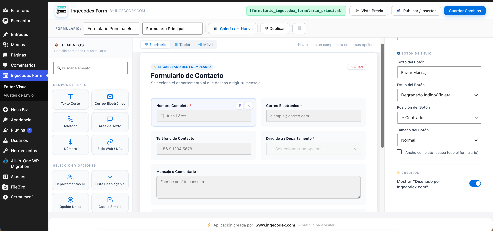
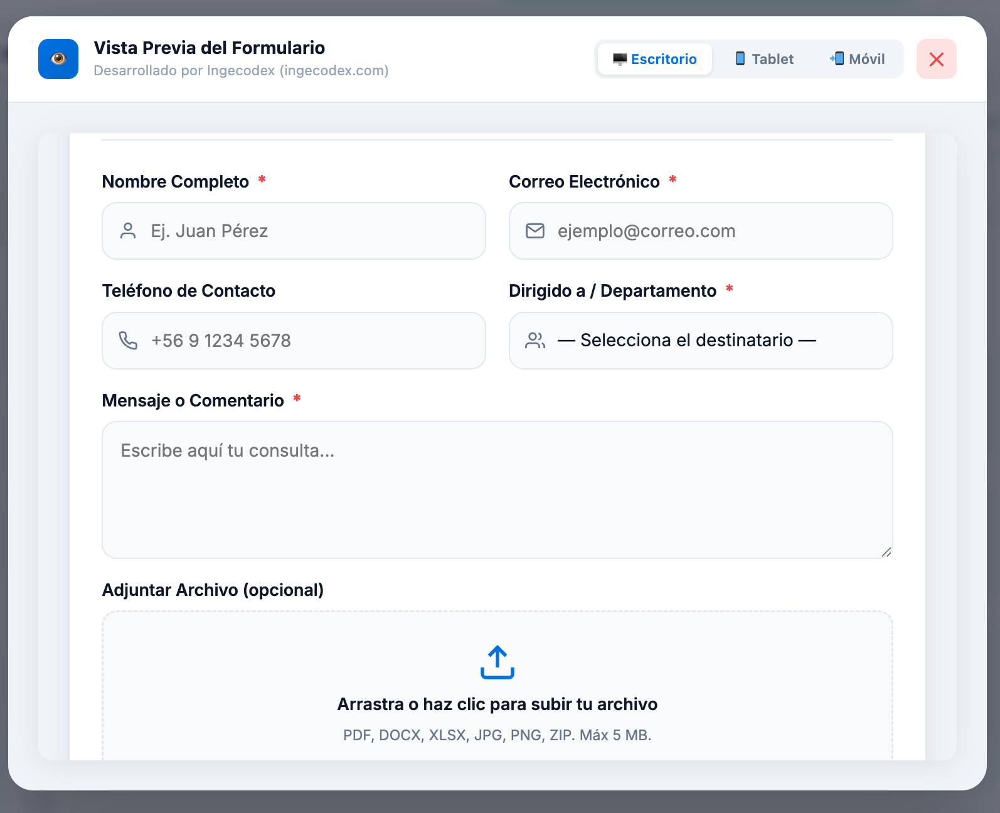
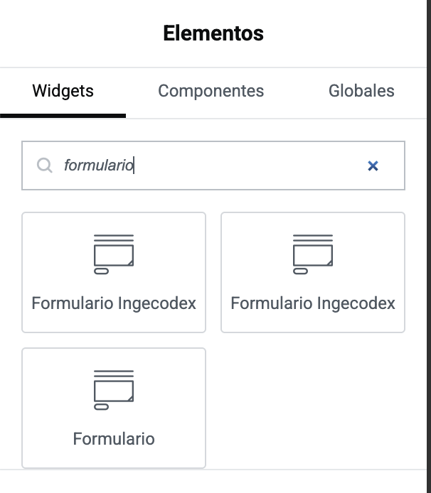
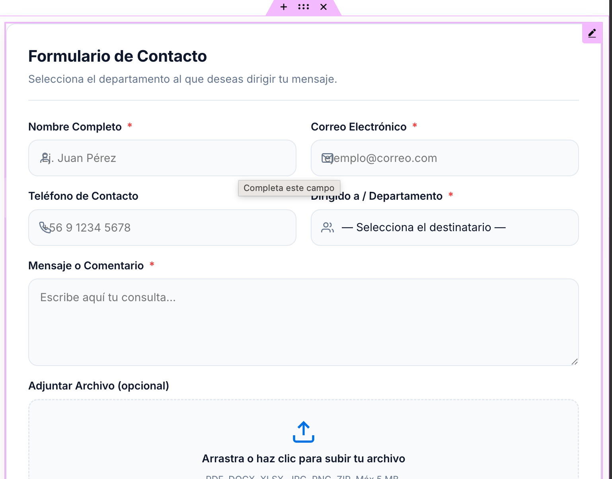
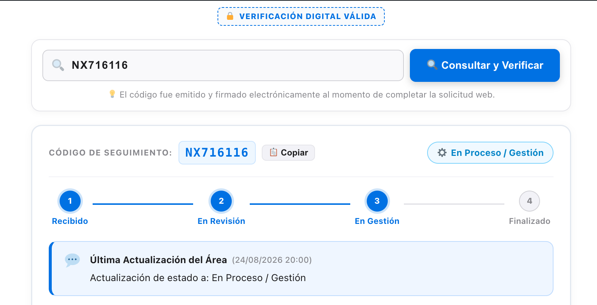

  

<h1 align="center">Ingecodex Form — Formulario Multidestino & Centro de Casos</h1>

  Visual form builder with multi-destination routing for WordPress & Elementor 
  <strong>Uso Gratuito · WordPress Plugin</strong>

  

  
  
  
  
  

---

🚀 **[Visita ingecodex.com para ver todas las características, screenshots y descargas →](https://ingecodex.com?utm_source=github&utm_medium=readme&utm_campaign=v2.5)**

---

**Ingecodex Form** es una suite profesional para WordPress y Elementor que transforma un formulario de contacto tradicional en un **Centro Integral de Casos, Requerimientos y Seguimiento Institucional**.

Diseñado con estándares de interfaz modernos y profesionales, incorpora constructor visual en tiempo real, seguridad avanzada con 2FA TOTP, bandeja de expedientes con derivación por departamentos, papelera con auditoría inmutable, y portal público de consulta de estado por código de ticket.

**Ingecodex Form** is a professional suite for WordPress & Elementor that transforms a traditional contact form into a **Comprehensive Case, Request & Institutional Tracking Center**.

Designed with modern and professional interface standards, it features a real-time visual builder, advanced 2FA TOTP security, case inbox with department routing, recycle bin with immutable audit, and a public status portal by ticket code.

---

## Screenshots / Capturas de pantalla

### 🖥️ Form Studio — Editor Visual
Constructor drag & drop con campos de texto, selección, departamentos y vista previa responsive.

### 👁️ Vista Previa del Formulario
Modal de previsualización con modo Escritorio, Tablet y Móvil.

### 🔍 Widget en Elementor
Busca "Formulario Ingecodex" en los widgets de Elementor y arrástralo a tu sección.

### 📐 Formulario Publicado en Elementor
Formulario renderizado con validación de campos y diseño responsive.

### 📋 Seguimiento de Caso con Trazabilidad
Portal público donde el solicitante ingresa su código enviado por correo para ver el avance de su solicitud.

---

## 🏆 Recommended Version / Versión Recomendada

> **v2.5.4** is the latest version with independent portal, 2FA login, and full file support.

> **v2.5.4** es la última versión con portal independiente, login 2FA y soporte completo de archivos.

| Version | Notes |
|---|---|
| **2.5.4** ⭐ | **Latest — Recommended** / Portal Independiente, Login 2FA, Archivos Completos |
| 2.5.3-beta | Pulido Visual Premium — Auditoría de Alta Gama |
| 2.5.2 | Portal Ejecutivo Independiente — Login Liquid Glass 2FA |
| 2.5.1 | Editor Actualizado y Dashboard Mejorado |
| 2.5.0 | Seguridad 2FA TOTP y Control Avanzado |
| 2.4.9 | Papelera, Auditoría Inmutable, Vista Página Completa |
| 2.4.8 | Bandeja de Casos, Estados, Portal Público de Seguimiento |
| 2.4.7 | Estabilidad y Compatibilidad Multidestino |
| 2.4.6 | Envío AJAX Asíncrono y Subida de Archivos |
| 2.4.5 | Alertas Sonoras Profesionales (Web Audio API) |
| 2.4.4 | Gestor de Roles y Perfiles de Acceso |
| 2.4.2 | Modos de Diseño del Contenedor |
| 2.4.1 | Diagnóstico y Avisos SMTP |
| 2.4.0 | Constructor Visual Form Studio y Enrutamiento |

[📥 Download v2.5.4 (latest)](https://github.com/ingecodex/webingecodex-extension/raw/main/public/downloads/ingecodex-form-2.5.4.zip) · [All versions](https://github.com/ingecodex/webingecodex-extension/tree/main/public/downloads)

> 💡 **¿Quieres ver todas las características en acción?** Visita [ingecodex.com](https://ingecodex.com?utm_source=github&utm_medium=readme&utm_campaign=v2.5.4) para una demo interactiva y descargas directas.

---

## 📚 Changelog

### 🔵 v2.5.4 — *Consolidación, Corrección de Errores y Soporte de Adjuntos*
- **Fix Crítico de JavaScript en el Formulario:** Se reparó error de sintaxis que congelaba el formulario al subir documentos.
- **Resolución del Bug de Archivos Adjuntos:** Ahora guarda la URL web exacta, permitiendo el botón de "📁 Documentos y Archivos" en la vista de cada caso.
- **Ampliación de Formatos Soportados:** DOC, DOCX, XLS, XLSX, ZIP, TXT, Powerpoint además de imágenes y PDF.
- **Eliminación del Error 403 (Favicon):** Se inyecta el logotipo oficial como ícono de pestaña.

### 🟡 v2.5.3-beta — *Pulido Visual y Diseño Premium*
- **Reconstrucción de la Pestaña de Auditoría:** CSS en línea resistente basado en diseño widgets-clone.
- **Interfaz de Alta Gama:** Avatares circulares, anillos de estado rotatorios, formato de fecha/hora alineada.
- **Búsqueda y Filtros Optimizados:** Barra de herramientas rediseñada con búsqueda blanca y redondeada.

### 🟢 v2.5.2 — *Portal Ejecutivo Independiente*
- **Portal Independiente (`?cm_portal=1`):** Aplicación a pantalla completa fuera del panel de WordPress.
- **Pantalla de Login "Liquid Glass":** Login premium moderno, ajeno a la estética de WordPress.
- **Seguridad Avanzada (2FA):** Soporte nativo para Google Authenticator en el login independiente.

### 🎨 v2.5.1 — *Editor Actualizado y Dashboard Mejorado*
- **Buscador de Códigos en Editor:** Nuevo estilo del buscador de códigos en Form Studio para mejor experiencia de usuario.
- **Dashboard del Administrador:** Actualización visual y funcional del panel de administración con mejor rendimiento y diseño.
- **Correcciones menores:** Mejoras de estabilidad y compatibilidad.

### 🛡️ v2.5.0 — *Seguridad 2FA TOTP y Control Avanzado de Cuentas*
- **Motor Criptográfico TOTP RFC 6238:** Generación y validación nativa de códigos dinámicos de 6 dígitos en PHP puro (cero dependencias externas). Compatible con **Google Authenticator, Microsoft Authenticator y Apple Passwords**.
- **Hook de Login en WordPress:** Exigencia obligatoria del código 2FA en `wp-login.php` para cuentas protegidas.
- **Sugerencia Automática de 2FA:** Banner de bienvenida y recomendación de seguridad para nuevos usuarios y encargados.
- **Panel de Gestión y Asignación Directa para Super Admin:**
  - Nueva columna `🛡️ Seguridad 2FA` en la tabla de usuarios con fecha y hora exacta de activación.
  - Botón **`🔓 Quitar 2FA`** para desbloqueo instantáneo en caso de extravío de teléfono.
  - Botón **`📲 Asignar / Generar Nueva Clave y QR`** para que el Administrador configure y muestre el QR directamente al Director o usuario.
  - Botón **`🔄 Restablecer 2FA`** para forzar una nueva vinculación.
- **Tabla Adaptable:** Diseño responsive fluido con scroll horizontal y alineación en una sola fila de todos los controles.

### 🗑️ v2.4.9 — *Papelera, Auditoría Inmutable y Vista en Página Completa*
- **Papelera de Casos (`tab=trash`):** Protección contra borrado accidental; los casos eliminados se trasladan a la papelera.
- **Filtro en Portal Público:** Los casos en papelera quedan ocultos del portal de seguimiento web.
- **Restauración en 1 Clic (`♻️ Recuperar`):** Función exclusiva para el Super Administrador.
- **Auditoría Inmutable:** Registro cronológico detallado de qué usuario envió el caso a la papelera y quién lo recuperó con timestamp.
- **Modo Solo Lectura en Papelera:** Bloqueo de cambios de estado y derivaciones en casos eliminados.
- **Vista en Página Completa (`&view_case=ID`):** Visualización de expedientes en página web dedicada además del visor modal flotante.
- **Impresión Oficial Formato Carta:** Estilos CSS de impresión optimizados para exportar fichas oficiales limpias en PDF/Carta.
- **Limpieza de Marcadores Internos:** Ocultamiento automático de etiquetas técnicas en notas públicas y del panel.

### 📥 v2.4.8 — *Bandeja de Casos, Estados y Portal Público de Seguimiento*
- **Bandeja de Entradas Administrativa (`tab=inbox`):** Panel interactivo para visualizar y gestionar todos los envíos.
- **Portal Público de Seguimiento (`[seguimiento_caso]`):** Página de consulta pública donde el solicitante ingresa su código para ver el avance de su solicitud en tiempo real.
- **Flujo de Atención por Estados:** Recibido, En Revisión, En Proceso, Requiere Presencia / Documentación, Resuelto.
- **Derivación entre Áreas:** Reasignación de casos entre departamentos con motivo justificado.
- **Notificaciones Automáticas por Email:** Envío de correo al solicitante ante cada cambio de estado.
- **Base de Datos Relacional:** Creación de tablas MySQL `cm_submissions` y `cm_case_events` para trazabilidad completa.

### 🔔 v2.4.7 — *Estabilidad y Compatibilidad Multidestino*
- Optimización en el enrutamiento de correos a múltiples destinatarios separados por coma.
- Ajustes de compatibilidad en widgets dinámicos de Elementor.

### 🚀 v2.4.6 — *Envío AJAX Asíncrono y Subida de Archivos*
- Envío inteligente de formularios vía AJAX con spinner animado y validación de campos sin recargar la página.
- Soporte para subida de adjuntos con Dropzone interactivo (drag & drop), validación estricta de extensiones y límite de peso.

### 🔊 v2.4.5 — *Alertas Sonoras Profesionales (Web Audio API)*
- Notificaciones acústicas en tiempo real ante la llegada de nuevos casos mediante tonos armónicos sintetizados con Web Audio API (cero archivos de audio externos).
- Alertas visuales flotantes (Toasts estilo Apple).

### 👥 v2.4.4 — *Gestor de Roles y Perfiles de Acceso*
- Separación de perfiles: Encargados de Área vs. Directores / Super Administradores.
- Módulo de restablecimiento inmediato de contraseñas de usuarios.

### 🎨 v2.4.2 — *Modos de Diseño del Contenedor*
- Estilos visuales: Glassmorphism, Flat, Sombra Moderna y Transparente.
- Personalización de bordes y fondos por campo.

### ⚙️ v2.4.1 — *Diagnóstico y Avisos SMTP*
- Panel de alerta exclusivo para administradores con acceso directo a la configuración de correo SMTP.
- Verificación de estado de envío de correos salientes.

### 🛠️ v2.4.0 — *Constructor Visual Form Studio y Enrutamiento*
- Lanzamiento del Constructor Visual interactivo **Form Studio** con drag & drop y previsualización responsive en vivo.
- Enrutamiento dinámico de correos por departamento.
- Modal emergente de Términos y Condiciones con aceptación automática.
- Widget oficial para Elementor.

---

## 🛠️ Shortcodes Disponibles

| Shortcode | Descripción |
|---|---|
| `[Formulario_Ingecodex]` | Formulario de contacto principal (Recomendado) |
| `[seguimiento_caso]` | Portal público de consulta de estado por código de ticket |
| `[formulario_ingecodex]` | Alias alternativo del formulario |
| `[consultar_caso]` | Alias alternativo del portal de seguimiento |

---

## 📦 Instalación

1. Descarga el paquete ZIP de la versión deseada (`ingecodex-form-2.5.4.zip`).
2. En tu WordPress, ve a **Plugins > Añadir nuevo plugin > Subir plugin**.
3. Selecciona el archivo ZIP, pulsa **Instalar ahora** y luego **Activar plugin**.
4. Accede a **Ingecodex Form** en la barra lateral para gestionar la bandeja de casos o configurar formularios.

---

## 📄 Licencia

Este plugin es de **uso gratuito**. El código no es open source.

Desarrollado por **[Ingecodex](https://ingecodex.com?utm_source=github&utm_medium=readme&utm_campaign=v2.5)** — Soluciones web profesionales.

- Website: [https://ingecodex.com](https://ingecodex.com?utm_source=github&utm_medium=readme&utm_campaign=v2.5)
- GitHub: [https://github.com/ingecodex/webingecodex-extension](https://github.com/ingecodex/webingecodex-extension)

---

  Si te sirvió, déjanos una ⭐ en GitHub — If it helped, give us a ⭐ on GitHub

